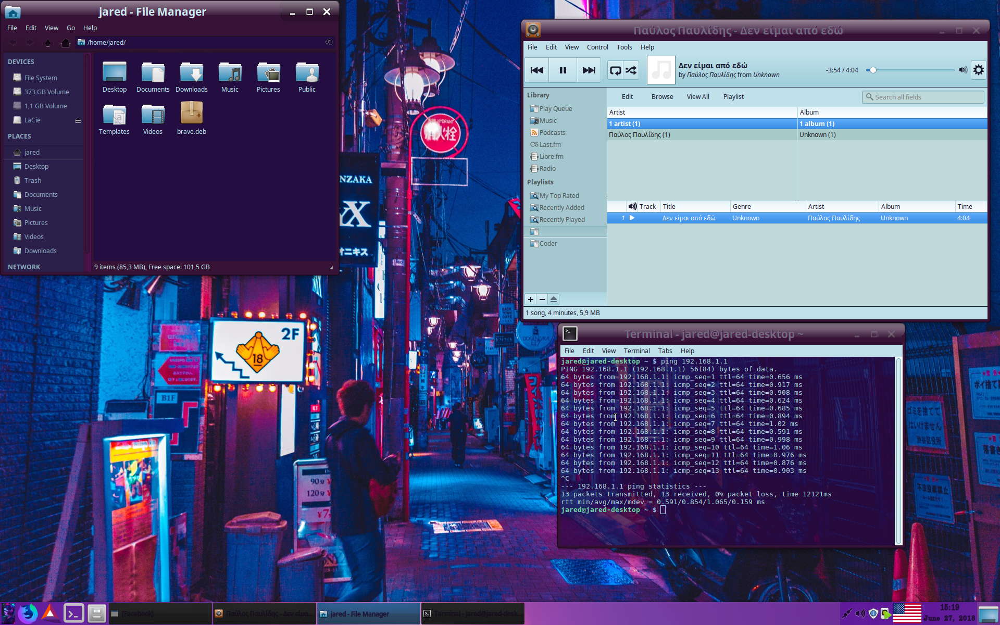

# NeonZ 

##### This is a recolor of the Greybird theme for the XFCE Desktop environment ,in order to match better the [Outrun aesthetics](https://www.reddit.com/r/outrun/).

##### This is what the theme can look like with a few adjustments:

##### The wallpaper background is the artwork of Benjamin Hung.
##### You can find him at http://www.benjamin-hung.com/

## Installation
##### After you have downloaded the repo,simply navigate to the folder containing the NeonZ folder.
##### Open the parent folder of NeonZ on terminal and type the command:
    sudo mv NeonZ /usr/share/themes/
##### Once you type your password ,you will be able to select the theme from the relevant menu.